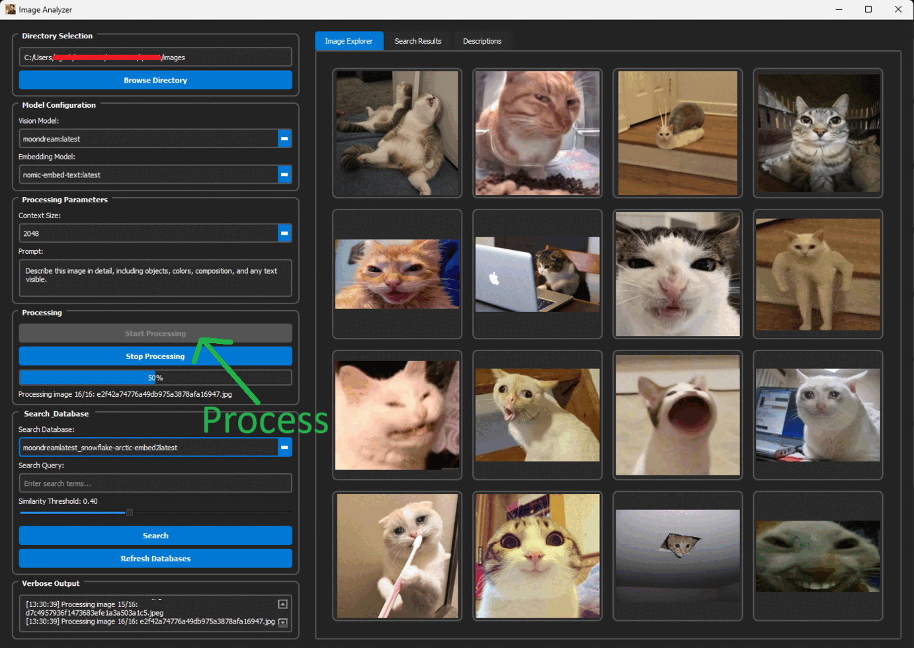

  

# 🧠 ImageAnalyzerAI by UgurkanTech

ImageAnalyzerAI is a high-performance desktop application that leverages local multimodal AI models to generate rich image descriptions and semantic embeddings. Designed for power users and researchers, it supports fast batch processing, semantic search, and database-backed storage — all wrapped in a sleek PyQt5 GUI.

## ▶️ Demo

Analyze and search images locally using AI-powered descriptions and semantic embeddings — perfect for organizing memes, emotes, or any large image collection.

## 🚀 Features

- **Local Ollama Integration**: Connects to Ollama for image captioning and text embedding using models like CLIP, BLIP, LLaVA, and BGE.
- **Multithreaded Inference**: Utilizes up to 24 threads for parallel image processing and embedding generation.
- **Semantic Search**: Combines cosine similarity with keyword fallback to retrieve relevant image descriptions.
- **Database Management**: Stores descriptions and embeddings in SQLite and Pickle formats for persistent access.
- **Dark Mode UI**: Built with PyQt5 and styled for low-light environments.
- **Clipboard Support**: Copy image previews directly from the search results.
- **Model Family Detection**: Automatically categorizes models into vision and embedding families.

## 🖥️ UI Overview

| Panel        | Description                                                                 |
|--------------|-----------------------------------------------------------------------------|
| Left Panel   | Directory selection, model dropdowns, and processing controls               |
| Right Panel  | Search interface with image previews, descriptions, and timestamps          |
| Tabs         | Switch between database preview and search views                            |

	
## 🛠️ Requirements

To run ImageAnalyzerAI, make sure the following are installed and properly configured:

- **Python 3.9+** — Recommended for compatibility with PyQt5 and multithreading.
- **Ollama running locally** at `http://localhost:11434` — You must have at least one **vision model** and one **embedding model** pulled.
- **Python packages**:
  - `PyQt5` — For the graphical user interface.
  - `NumPy` — For handling embedding vectors and similarity calculations.
  - `Requests` — For communicating with the Ollama API.

Install all required packages using:
`pip install -r requirements.txt`

> A PyInstaller build script is included to generate a compact standalone `.exe` for portable distribution without requiring Python on the target system.

## 📂 Usage
1. **Start Ollama locally** and ensure that at least one **vision model** and one **embedding model** are pulled and available.  
   These models are required for generating image descriptions and semantic embeddings. You can pull models using `ollama pull <model-name>`.

2. **Launch the application** by running `python main.py`.

3. **First Run**:
   - Select a directory containing images.
   - Choose a vision model and an embedding model from the dropdowns.
   - Click **Process** to generate image descriptions and semantic embeddings.
   - These results are saved locally in a database and embedding file for future use.

4. **Subsequent Runs**:
   - Previously processed data is automatically loaded.
   - You can immediately perform semantic or keyword-based searches without reprocessing.
   - Reprocessing is only needed if you change models or add new images to the directory.
   
## 📦 Portable Build

A PyInstaller build script is included to generate a compact standalone `.exe` version of the application.  
This allows ImageAnalyzerAI to run as a portable app without requiring Python or external dependencies on the target system.

- The build is optimized for minimal size.
- All required assets and dependencies are bundled.
- Ideal for distributing the app as a single executable.
   
## 🧪 Search Logic
- Semantic Search: Cosine similarity between query and stored embeddings.
- Fallback: Keyword search if all images are below threshold or ollama is offline.

## 📜 License
See the LICENSE file in the repository for usage terms
